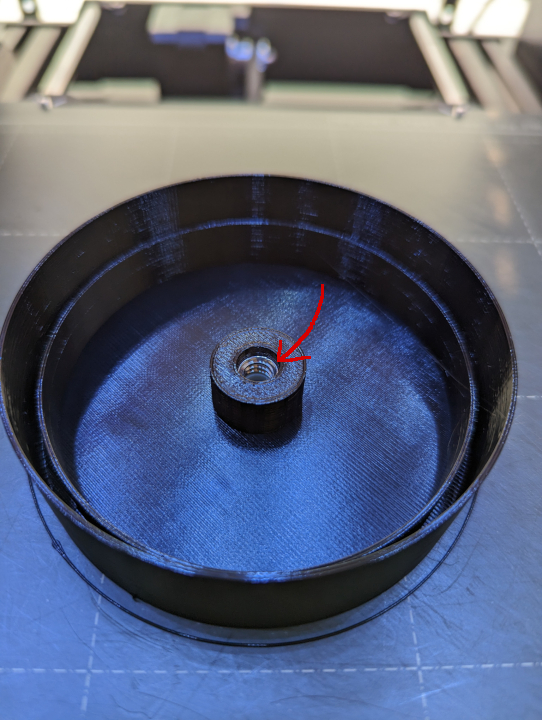
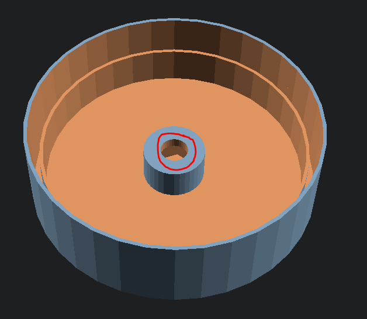
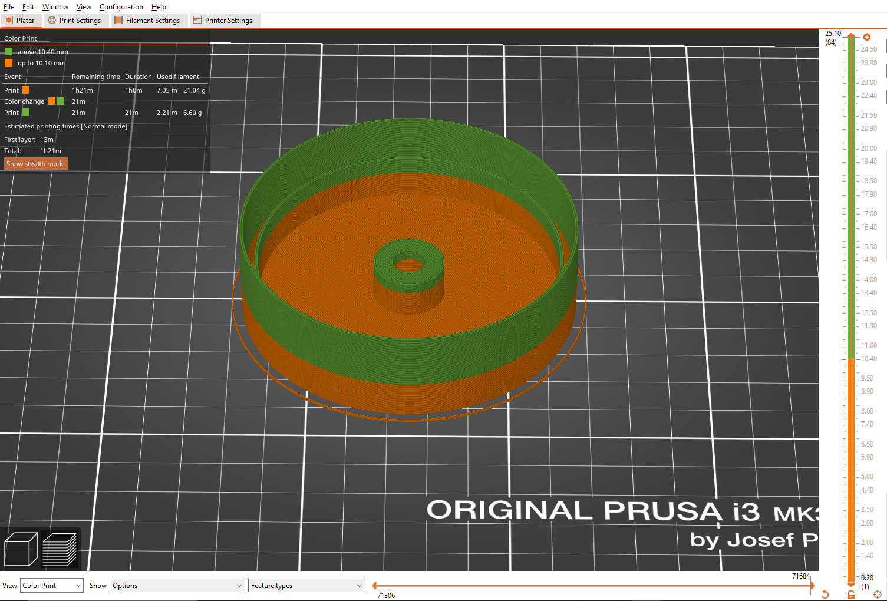
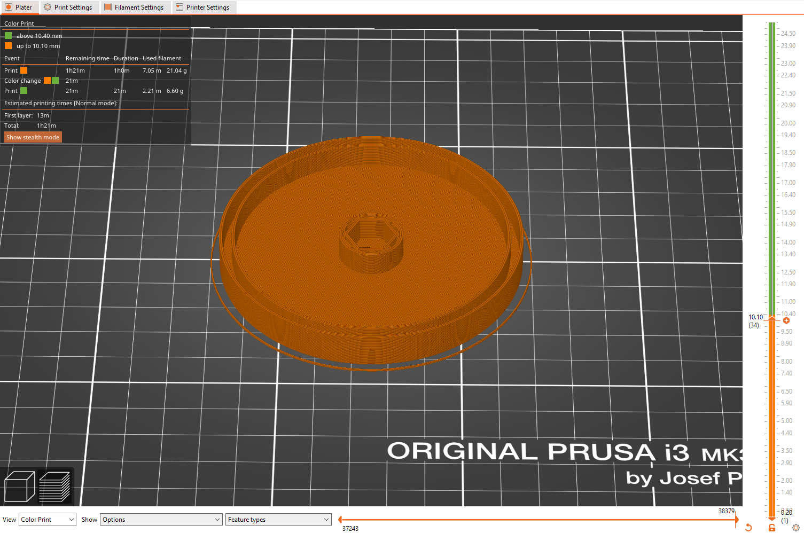
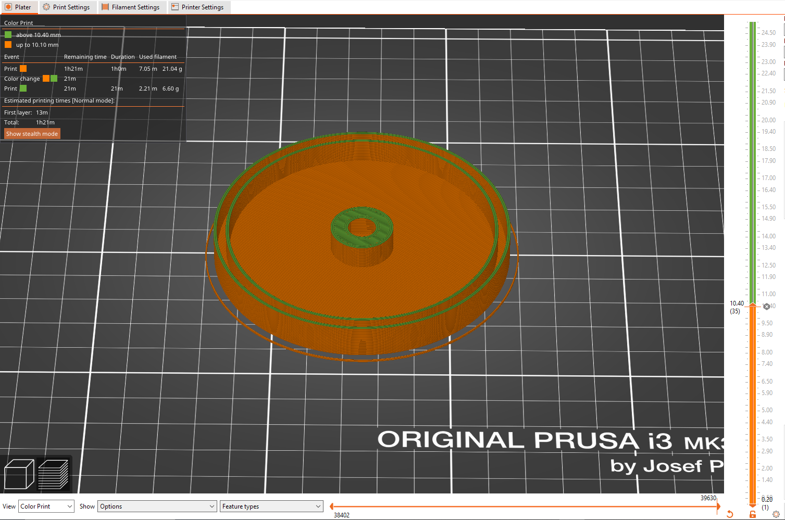

## The Problem
I've been designing parts for a Roller hockey wheel container that utilizes a PVC pipe as the main container body. For the cap, it had to both screw onto a 1/4in threaded rod and also be capable of lifting the rod with all of the wheels out of the PVC pipe container. Prior to 3d printing this part I was just using a loose, pipe end cap with a hole in the center for the threaded rod to fit through and then used a hex nut to allow for the end cap to then pull the threaded rod and wheels out. I wanted to replace this design with a singular part that could be screwed on and off the threaded rod and also lift the entire rod and wheel assembly out. One difference was that I wanted the hex nut to be attached to the 3d print in a permanent fashion, but unlike before, I wanted the nut to be on the inside of the cap for better aesthetics and to keep the cap flat with minimal added height. The only issue is that simply gluing the hex nut to the inside of the cap will not provide enough strength for the cap and hex nut to lift the assembly out of the pipe without the glue giving way. If not immediately, definitely over time. Because of this, I had to better secure the hex nut to the 3d printed cap.

## The Solution
While I could have designed some system with printing, or using additional parts to secure the hex nut, I thought it would be far simpler if I could just design a pocket in the print for the hex nut to live in.

This keeps it simple as it's only 1 singular 3d print, but it also strengthens the hex nut-to-cap connection because again, it's 1 solid 3d print. But how do I get the hex nut into the 3d print? Well, the simplest solution is to just monitor the print and pause it right before it starts to print the roof on the hex nut's pocket. After you pause the print, simply add the hex nut and then resume the print. This works since 3d printers only increase their z height as they print and don't go to lower layers after completing them. Thus if we insert the hex nut and make sure it's completely below the currently printed layer height, once we resume the print, the printer will just happily print on top of the hex nut since to it, it's no different than if it was filament on a lower layer. Just be extra sure that the hex nut is completely below the printer's current working z height as you can cause issues if your printer's hot end/ nozzle were to make contact with it.

So that's great, but having to monitor your print and constantly check if the printer is on the right z height is not ideal. Worse, if you miss it, the printer will cover the pocket where the hex nut should be and thus you are no longer able to insert your hex nut into the print! It'd be better if there was a way to make the printer automatically pause on the right layer. Now, this is probably not the only solution. I haven't done any research into methods of doing it, I just happen to know of 1 method to do this. That method is adding a filament color change at the layer where the roof of the pocket is to be printed. 

**Full Slice**

**Layer Before Color Change**

**Layer After Color Change**

Obviously, this doesn't work if you have a printer that can auto-change filaments for you, but given I just have a stock Prusa mk3s+, I don't have this feature, so the printer will simply pause itself and request that I manually change the filaments out. This gives me an automatic point where the print will stop and I can add in the hex nut before "swapping out" the filament and then having the printer continue the rest of the print!

And voila! I now have a solid 3d printed part with a hex nut fully encased in it!

## Future Improvements

This isn't really anything about improving this process, though let me know if you have any better solutions to this, this is more about future improvements to my roller wheel container design for myself, so feel free to ignore this. Currently, you have to lift the wheel and rod assembly out with the top cap and then twist the top cap off. These 2 steps aren't bad, but I think there's a better solution. Instead of lifting the assembly out of the pipe, I think it would be better to lift the pipe off the assembly. Let me explain more. There are currently 5 parts to the container. The Pipe, top cap, bottom cap, rod, and wheel "base". The base is the part that keeps the wheels on the rod when you lift the rod out of the pipe. It's fine, but it adds extra complexity to the design. Instead of having to require an additional piece for the base, I should shift that function to the bottom cap. The bottom cap though can't be pulled out when you pull the top cap, so now if I were to take the top cap off all of the rod would come out, but all the wheels would stay in the pipe. This is true, but instead of the top cap pulling out the rod, what if I made the top cap pull the pipe off the bottom cap, wheels, and rod? Now I have easy access to the wheels and a flat base for everything to sit on. I'd also argue that twisting the cap and pipe and then lifting that off is much more convenient than having to lift the top cap and inner assembly out and then twist the top cap off. Additionally, this all requires one less part as now the inner base for the wheels has been eliminated!

Yeah, I think this is definitely the move for future iterations of this design.