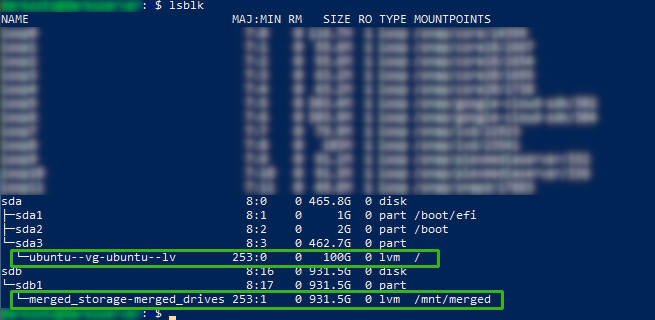
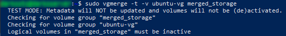
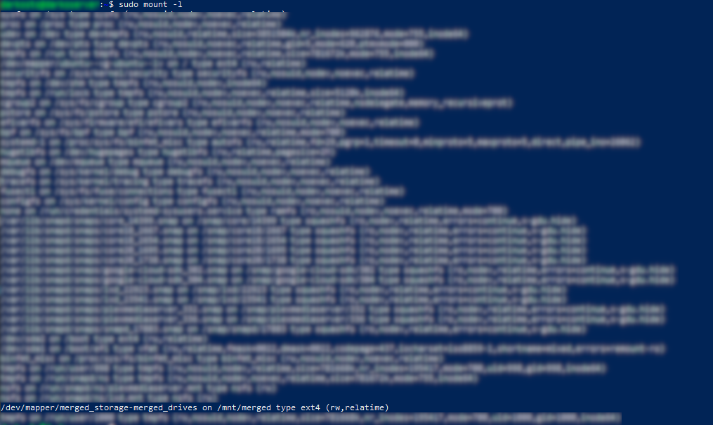
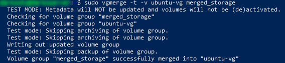
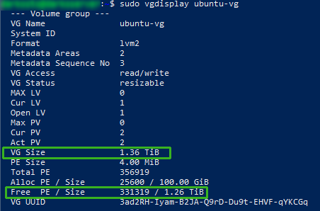
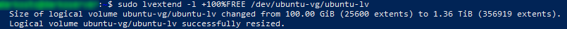
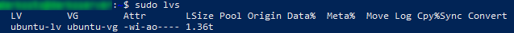
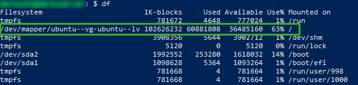
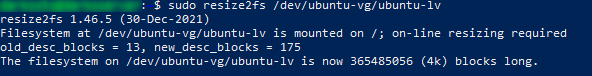
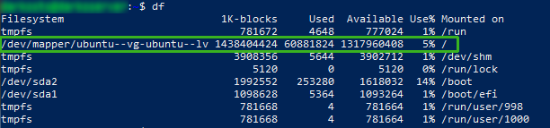

As with all my posts, if you see any issues with the solution here feel free to open an issue on the [GitHub repo](https://github.com/TheTurkeyDev/blog)!

## The Problem

I was recently asked if I knew how to "merge" a new disk's space with an existing disk in Linux to make the existing file system span the size of both disks. I had never messed around with the logical volume side of Linux before, but I gave Google-fuing it a shot. In the end, we utilized LVM to do this. It's a pretty common tool and I believe in Ubuntu and likely many other major Linux distros it is included by default.

The end goal here is to have 2 physical hard drives share their space via a volume group so that the logical volumes and file system can work as if they were 1 big drive. Do note, doing so means if 1 drive fails, you likely lose all your data, so be aware of the risks!

## My Solution

In helping my friend out, he already tried some steps to attempt to solve this problem, so he had gotten himself into a weird state. If you are doing this and have not done anything to your drive you can proceed to the next section. If you have tried to do this, but failed, you may be in for a longer ride and this write-up may not be much help, but proceed to [The other section](#both-drives-already-have-a-logical-volume-and-a-volume-group) and read what we did there for my friend's specific situation. Maybe it'll help you.

### Adding a fresh Drive

If you have a fresh drive you've added to your system and have not done anything to it yet, your life should be pretty easy.

If not, well this may not be very helpful...

**NOTE**: I have not verified these steps yet! Try at your own risk! Once I have been able to verify these steps work I will remove this note and make any changes as needed. If you try this your self feel free to make an issue report on the previously mentioned GitHub with if this worked, or didn't, and any changes that need to be made!

Run `lsblk` and find the new drive you've just added. Not sure the best way to explain this step and how to find it, so I'm expecting some knowledge of the Linux file system here. I will edit this bit when I can come up with a better explanation of how to do this.

If you already have a volume group (Run `vgscan` to list existing volume groups) we can simply add the new drive's partition to the existing volume group with `vgextend (vg) (disk partition)` replacing `(vg)` with the name of the volume group (ex: `ubuntu-vg`) and `(disk partition)` with the name of the disk partition to add (ex: `/dev/sdb1`). If your drive is fresh, it will likely only have 1 partition on it being the size of the drive.

If you don't have an existing volume group we can create one and better yet, we can create one spanning multiple drives in 1 command! Simple run `vgcreate (vg name) (disk 1 partition) (disk 2 partition)` where `(vg name)` is the name you want to give to this volume group, `(disk 1 partition)` is the partition on disk 1 you want to add, and `(disk 2 partition)` is the partition on disk 2 you want to add. I'm focusing on 2 different disks here, but realistically it can be whatever 2 partitions you want under the same volume group, so technically if you had a weird setup on 1 drive with 2 partitions where you couldn't make them 1 partition, you could make a group across them, but that seems kinda weird.

Now that the Volume Group exists and has 2 drives on it we need to work on the logical volumes.

If you already had a volume group before this, you will likely also already have a logical volume, but you can run `lvscan` to check. If you run this and have no logical volume listed or no logical volume listed associated with the desired volume group we must make a logical volume. Simply run `lvcreate -l 100%FREE -n (lv name) (vg name)` where `(lv name)` is the name you want to give to this logical volume and `(vg name)` is the name of the volume group created (or desired to be used) from above. Note, you can control how much space this logical volume occupies on the volume group. I'm assuming you want it to fill the full size of the remaining free size in the volume group, so I used `-l 100%FREE`, but you could fill only half the remaining free size in the volume group using `-l 50%FREE`, or if you want to make this logical volume have a specific size, you could use `-L 50G` to give it a specific size. Simply replace `50G` with the desired size!

Sweet! Now our logical volume is our desired size! The only step left is to expand our file system to fill the logical volume. This can be accomplished with `resize2fs /dev/(vg)/(lv)` where `(vg)` is the name of our volume group and `(lv)` is the name of our logical volume.

That's it! Our file should now be spanning both drives!

### Both Drives already have a Logical Volume and a Volume Group
The initial state looks like this. We have 2 drives, sda and sdb with each already having a logical volume and volume group.

sda's volume group and logical volume are on the sda3 partition and the volume group is `ubuntu-vg` while the logical volume is `ubuntu-lv`. I believe they both "wrongly" show 2 `-` in the names because `-` is used to separate the volume group and logical volume, so having 2 `-` is an escape character of sorts. Either way, just know the names only have 1 `-` in them. Getting back to sdb, its volume group is `merged_storage` and its logical volume is `merged_drives`.

You can confirm this by running `vgscan` to get all the volume groups.

Luckily, LVM allows us to merge 2 volume groups together, so that's where we will start.

To merge 2 volume groups together we can run `vgmerge -t -v ubuntu-vg merged_storage`. Using `-t` here will simply run this as a dry run or test. `-v ubuntu-vg merged_storage` simply tells `vgmerge` which volumes to merge together. In this case `ubuntu-vg` and `merged_storage`.

Unfortunately running this command gives us an error saying `Logical volumes in "merged_storage" must be inactive`. As the error implies, we must first deactivate the logical volumes in `merged_storage` in order for us to be able to merge it into `ubuntu-vg`. Before we can deactivate the logical volumes though, we must first unmount the logical volume. Ideally, you would know where you've mounted the logical volume, but in this case, since it wasn't my system, I did not know. I don't know if there is a better way to do this, but I know `mount -l` will list out all of the mounted devices and when I say all, I mean ALL of them...

As you can see from this, there are a lot of things mounted. Searching through this though we finally come across `/dev/mapper/merged_storage-merged_drives on /mnt/merged ...` Which tells us that our logical volume is mounted on `/mnt/merged`, so time to unmount it with `umount /mnt/merged`.

With it unmounted we can now remove the logical volumes using `lvremove merged_storage`. If we only wanted to remove a specific logical volume, such as `merged_drives`, we would use `lvremove merged_storage/merged_drives`, but for our scenario, we want to remove all the logical volumes on the volume group, so we simply pass the volume group `merged_storage` and `lvremove` will remove all the logical volumes from it.

Now that the logical volumes have been removed we can now go back and proceed with merging the drives! This time running `vgmerge -t -v ubuntu-vg merged_storage` will return back a success message.

This means we are good to run this command for real! Simply remove the `-t` to give us the command `vgmerge -v ubuntu-vg merged_storage` and after running it our volume groups should be merged into `ubuntu-vg`. At this time, it is also good to remove `merged_storage` from our fstab file `/etc/fstab` if it was added there as our system will attempt to mount the now nonexistent logical volume on boot which is no good.

Now we have our new merged volume group and if we run `vgdisplay ubuntu-vg` 

We can see that the size of this volume group is 1.36 TiB. That's Tebibytes which is about 1.5 Terabytes. Data storage terms can be confusing. Either way, you will notice that is not simply the size of both drives' capacity and you'd be correct! We haven't merged the full capacities of both drives, only the capacities of 2 partitions. sda3 and sdb1 to be specific. Now I don't want to get too technical here but know this is perfectly ok and in fact, we don't want to merge all the partitions as some partitions are meant to be on their own!

Our Volume group is the right size, but our logical volume is still the same size as it was before. That's because merging 2 volume groups will expand the volume groups size, but not any logical volume. To expand our logical volume to fill the volume groups size we can run `lvextend -l +100%FREE /dev/ubuntu-vg/ubuntu-lv` which simply says to expand the logical volume to fill 100% of the free space in the volume group it's in.

If we run `lvs` after expanding our logical volume we can see that its size now matches the volume groups size

If we run `df` however, we still see that our root hasn't expanded and that's because we still haven't expanded our filesystem to fill the logical volume it's in.

To expand our filesystem we can simply run `resize2fs /dev/ubuntu-vg/ubuntu-lv`.

Now if we run `df` again we will see our root folder has now expanded and reads the correct size!

And that is all! Our file system now stretches across 2 drives!

## Helpful/ Used Resources
- [LVM Command "cheat sheet" & LVM structure diagram](https://christitus.com/lvm-guide/)
- [Redhat post on expanding a logical volume](https://www.redhat.com/sysadmin/resize-lvm-simple)