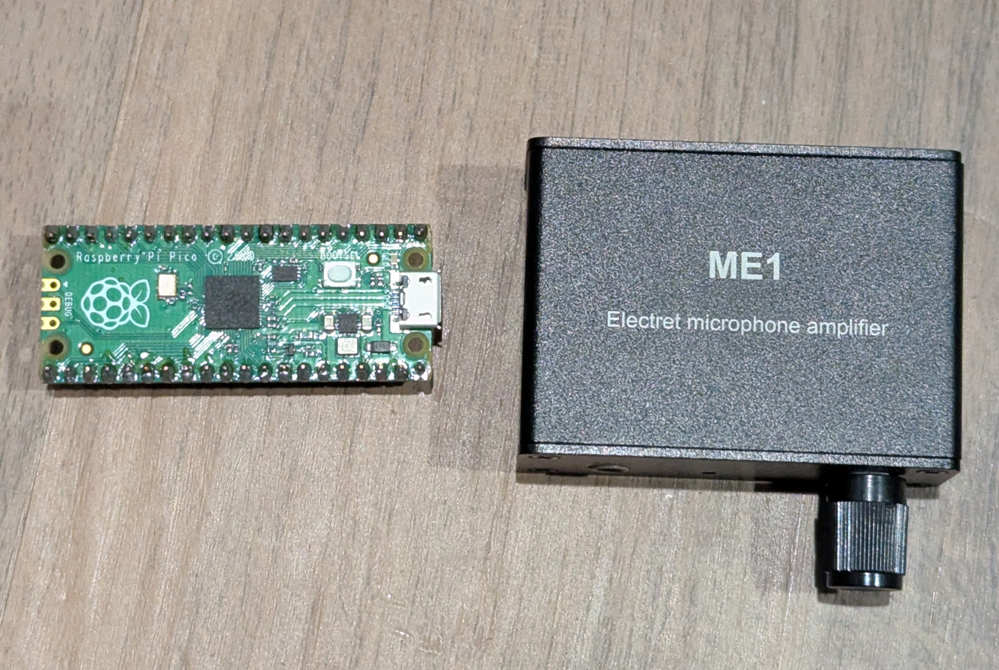
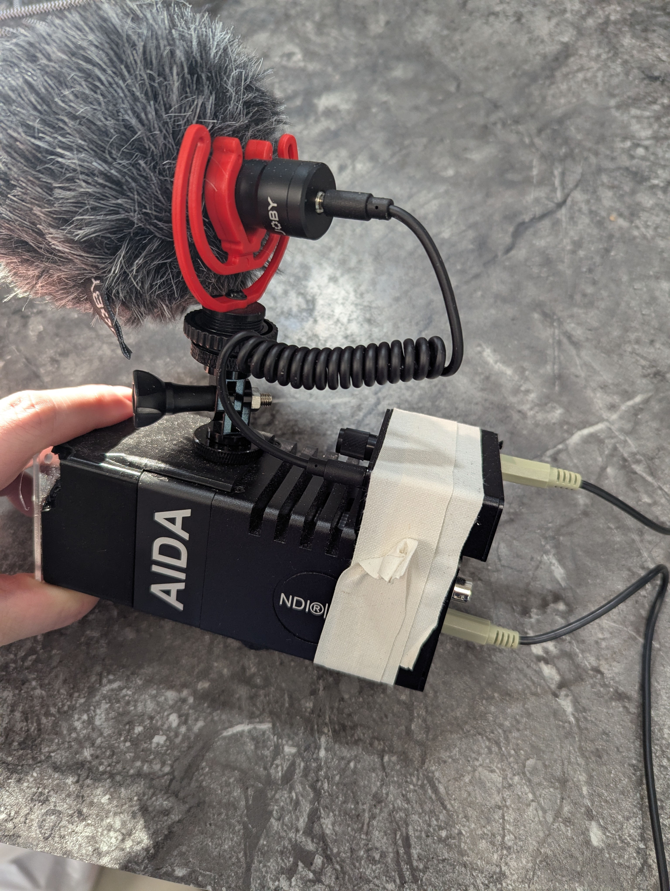
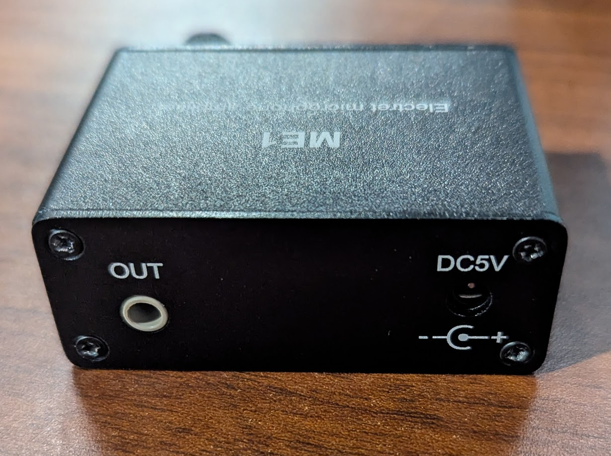
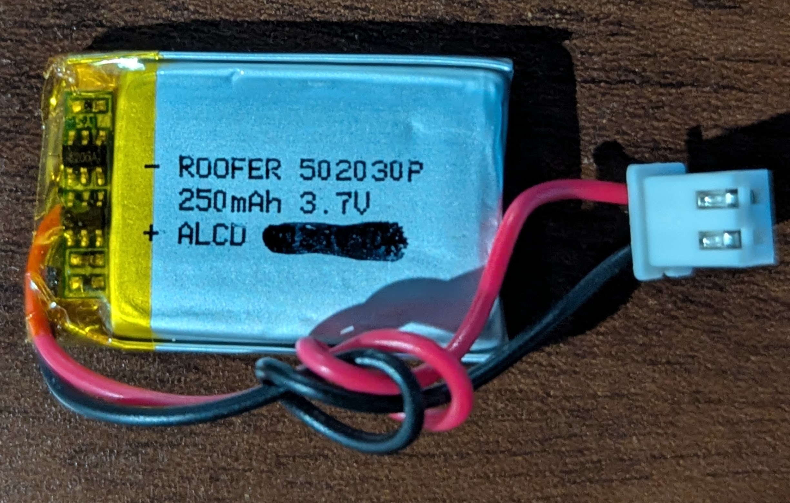
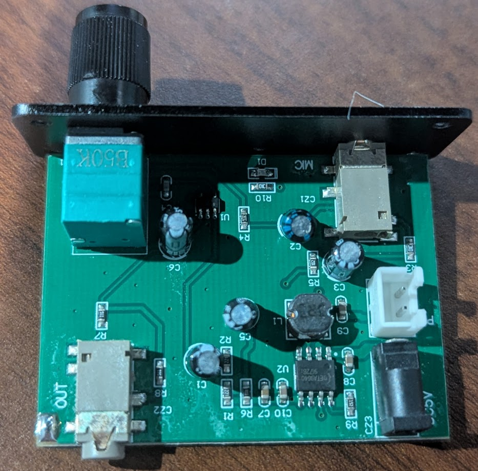
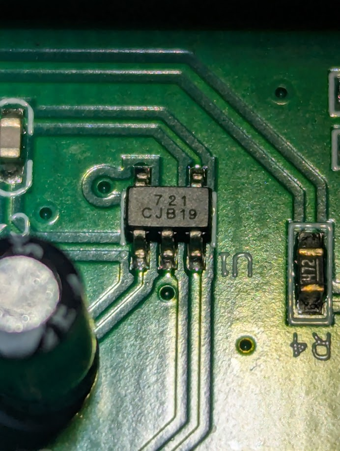
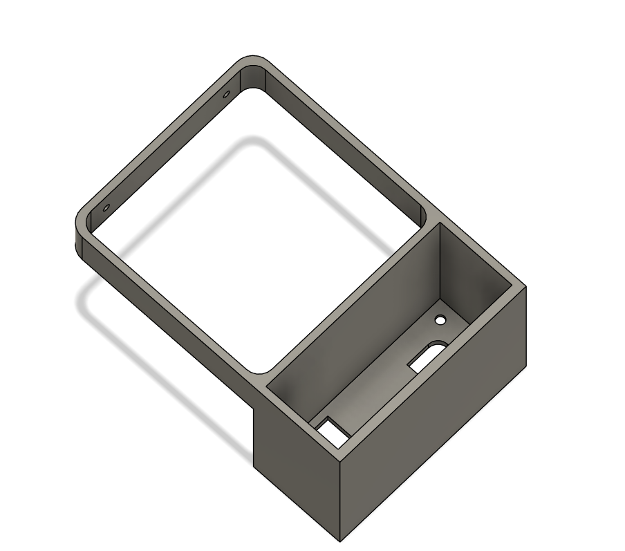
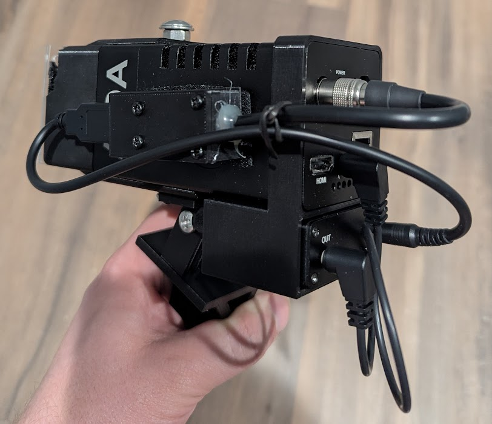

## Problem & Goal

Over the past year, I have been developing [Rink Vision](https://rinkvision.com/), which is the live streaming and video on demand service for Heatwave Arena. One thing the platform is missing is audio on video from the cameras. The original cameras we bought were the [AIDA HD NDI Cube's](https://aidaimaging.com/hd-ndi-cube/), but they have no audio in options on the camera to add audio to their video streams. Adding audio in the software on the ingest server for Rink Vision could be possible, but is more complex and compute intensive than desired. 

We've since upgraded one of the cameras to the [AIDA HD NDI 200](https://aidaimaging.com/hd-ndi-200/) and it does support audio input. The problem? It's expecting a [line in](https://www.shure.com/en-EU/insights/differences-line-mic-level) audio source. Why line in? Not sure. That's a question for AIDA's design team, but I did reach out to them to ask what their expected, or default use case for it was and got this response back

> ... 
> The audio input is a line in audio. A microphone isn’t strong enough to be heard over the jack unfortunately. I would recommend either running a pre-amp to bring the microphone to line level, or running it into a mixer, which is then run into the camera for audio embedment.
>
> ...
>
> We’ve found that microphones that have batteries usually work fine with the camera (since its amplifying the sound.)
> 
>
> Our customers have lavalier and shotgun mics that work fine – so something like that with batteries will work great.

A mixer seems very odd to do and run into the camera, but would indeed work. A pre-amp and/ or battery powered microphone seem like solid options, but there's just one problem with each of these. For the battery powered microphones, these aren't quite ideal as the goal of the microphone would be to have it on 24/7 and having to remember to change out or replace batteries is a straight up deal breaker. A pre-amp seems to be the best solution, but the problem for these is supplemental power. A pre-amp needs to be powered by another source as it's adding energy to the audio levels and boosting the voltage from a mic level input to a line level input, but unfortunately with our setup. Our cameras are POE powered and fairly "remote" from other power sources. There's no real way to add another power brick or what have you, in order to power the pre-amp itself. This is what leaves us in our current pickle and looking for an out of the box solution.

## Initial Pre-amp Testing
Before getting to far ahead of myself, let's just verify that a pre-amp solves the issue in the first place. I actually did try to use a [DJI Wireless mic](https://www.dji.com/mic-2) first, but it seemed to be very quite still, even with the gain's turned up. Not sure what the issue was there or if the DJI mic's don't have true line out audio, but I'm moving on from those anyways due to the battery powered issue mentioned earlier.

In terms of preamp options, I'm actually pretty limited. Turns out a 3.5mm mic in to a 3.5mm mic out, phantom power, or related pre-amp device is kinda niche. Some mixers could do this for a proof of concept test, but I don't actually have any, so I scoured amazon and found a very generic [Electret Microphone Amplifier](https://www.amazon.com/gp/product/B0D7BWRFZD). 3.5mm in, 3.5mm out, with a 5-12V DC power in. It does have a battery, but I'm hoping I could by-pass this in the future.

The pre-amp itself is actually pretty compact as this photo comparing it to the size of a pi pico shows. 

It's only about 1 inch tall too, but does it work? Yes! Pairing it with a random microphone I have from one of my cameras you can see from this clip that the sound works and has a pretty good pickup.



## Hacking The Pre-amp For Our Use Case
While it works, this setup is very clunky

and still has the major flaw of currently being battery powered and needing to be recharged, so I focused on solving this problem first.

Taking the metal case off it was easy as it only had 4 screws on each faceplate

From there I was able to push the main PCB out. The battery was glued on top, so I had to be careful with that, but overall, it was easy to take apart. I wasn't quite sure how to take the knob off tha gain control, so I just left it for the time being holding on the front face plate.

The battery is a simple 250mAh LiPo 

The PCB is a little more interesting in that it's actually very simple. 

Most of the footprint and components are actually for the charging circuit for the LiPo powered by a [ETA9640](https://www.eta-semi.com/wp-content/uploads/2022/03/ETA9640_V1.5.pdf) IC.

The key IC that I wanted to know was the one that actually handled the amplification of the audio. It's pretty easy to see which on that is, but sadly my Google efforts to find it didn't yield anything.

Initially I wanted to look into making my own PCB for this, but I think It'll be easier for now to just make this work. I did remove the LiPo battery as this will be always powered and has no need for the LiPo battery.

I designed a 3D printed holder for the amp to sit below the back of the camera to make interfacing with it easier.

## Powering the Pre-amp

The preamp is attached nicely to the camera, but now it needs power. It would be nice to steal the power from the POE input, but that's a bit complex. A far hackier solution would be to steal power coming out of the camera. From the available ports on the back of the camera, there are 2 contenders. The first is a micro USB port labeled SVC and the other is an I/O Port with some weird 6 pin connector. Neither port is meant to supply power and is wildly out of spec, but I only need a few hundred milliamps and _should_ be ok.... I think...

The I/O port I know likely has power as it is used to power the camera if not using POE. Unfortunately, it takes in 12V for input power and the Pre-amp needs 5V. Workable, but the better solution would be 5V from the micro USB. Connecting a usb break out to it and powering the camera sadly did not yield 5V on the VCC line.

The I/O port comes with a breakout cable with one end plugging into the camera and the other end splitting out to an RS-485 connection and a 12V barrel jack. Testing the barrel jack does yield 12V while the camera is powered. Now I just need to convert the 12V down to 5V for the pre-amp to use. Luckily I have a few 5V regulators meant for drone motors that are able to take the 12V and lower it to 5.

The only missing piece is the connector for the camera's I/O port. I could reuse the provided cable, but it's a bit bulky and cumbersome, so after some Google-fu and searching I some how found the connector by searching for `Hirose 6 pin connector`. I have no idea if that's the actual name of the connector, or just the name of a manufacturer of that connector, but I picked one up off amazon and after some rough soldering later I have this master piece.

You can see the pre-amp slotted on the bottom back of the camera and on the side is the 5V regulator and USB port to more easily connect to the pre-amp's power plug. It's a mess of wires, but it needs to work before I can improve the system.

Now with it all hooked up and ready to use, how does it sound?



Well unfortunately there seems to be a high pitch ringing sound in the audio. I can actually hear this physically coming from the audio amp as well. I'm far from an audio or electrical engineer, so my best guess is that the 12V power source isn't very clean or there is some sort of interference on the audio line. Or even a combo of both.

## Next steps ##

This is just the second iteration of the proof of concept system with this variant not needing a battery or second external power source. There is still lots to improve. Mainly I want to reduce the number of wires and better mount the regulator which will hopefully help in reducing the wire mess.

A custom PCB may also be needed to to not only help reduce wires, but to also help clean and isolate the power source so it's not effecting the audio quality.

I will try and update this post as revisions and changes are made
