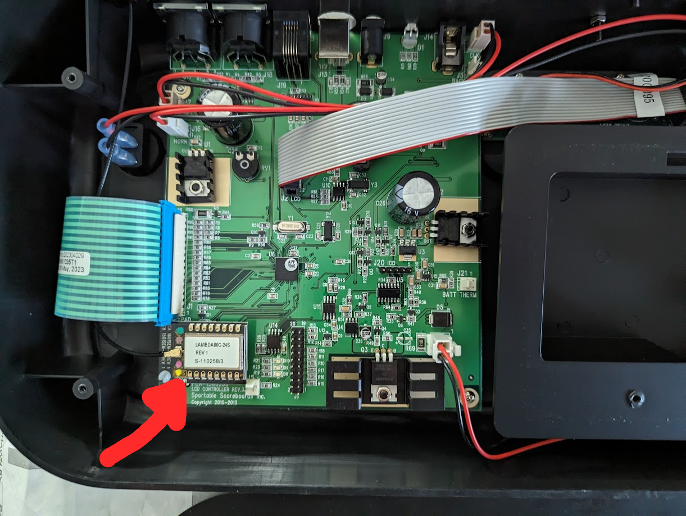
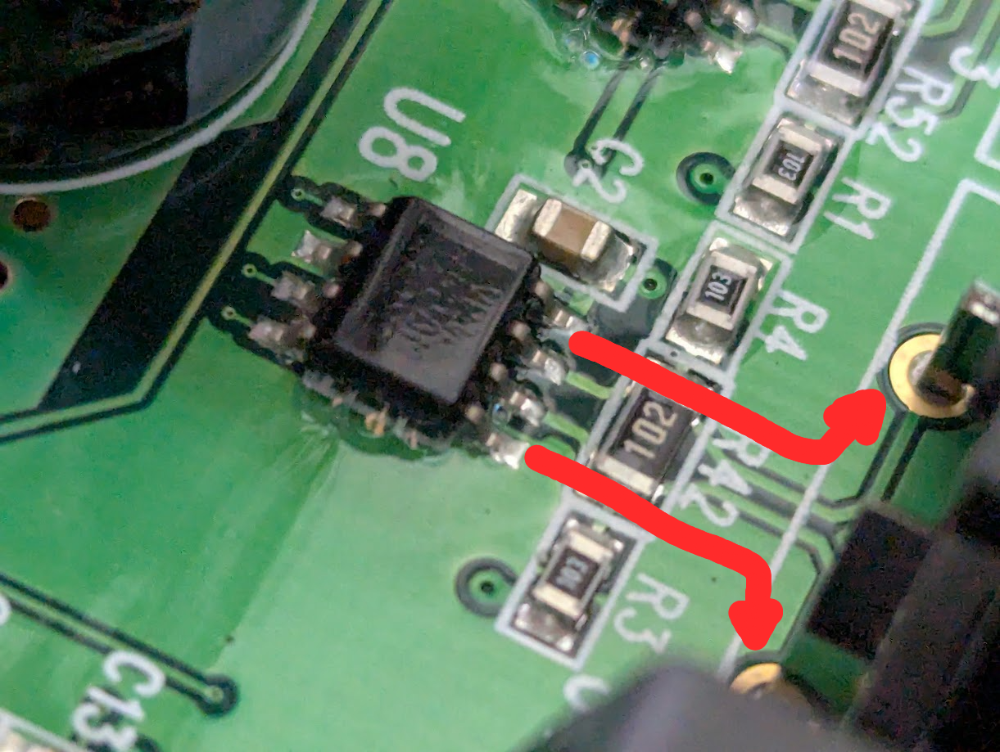
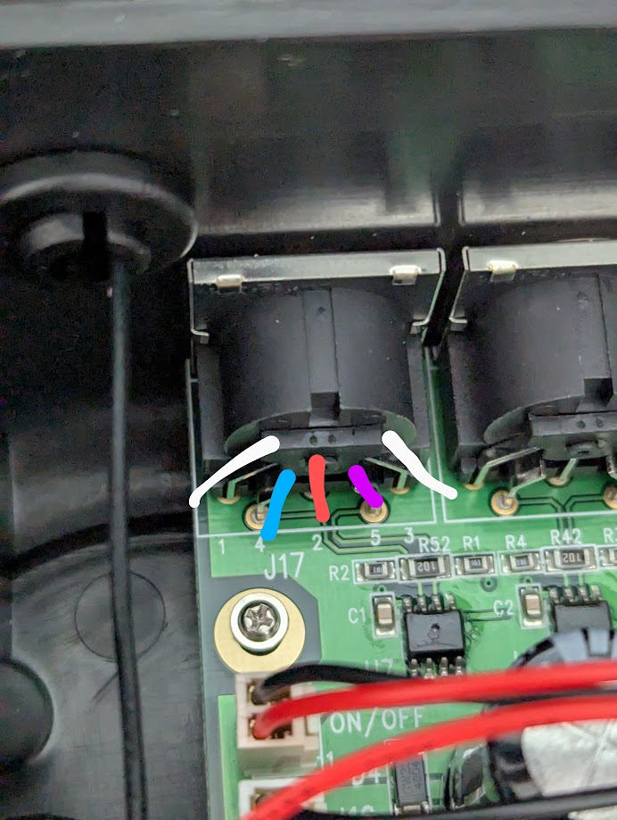
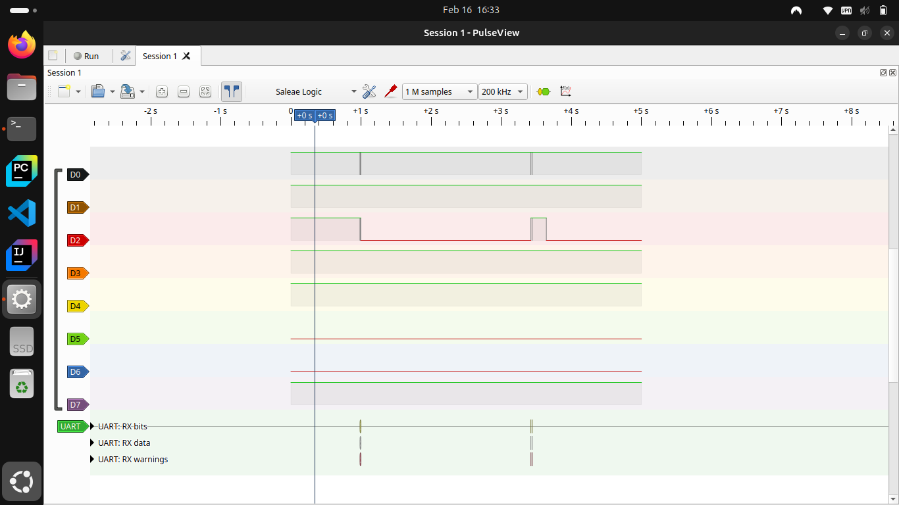
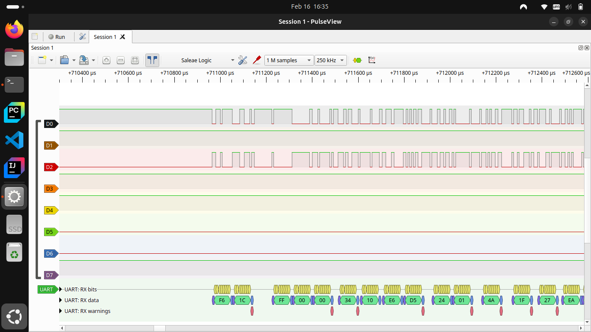
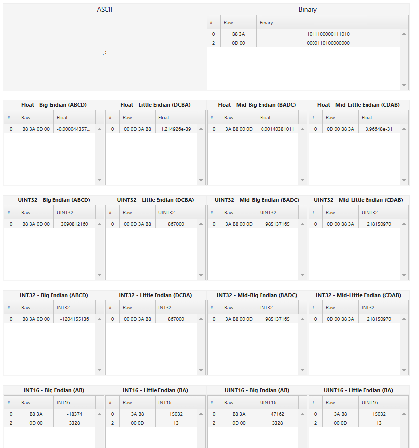
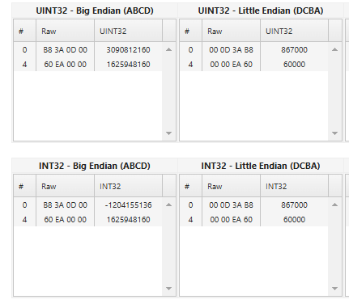
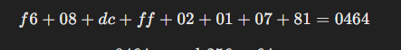

## Premise & Goal
I am attempting to hack the scoreboard at Heatwave Area, or well kind of. The goal for now is just to be able to read the current state of the scoreboard and be able to utilize that information for other projects. [I’ve been streaming some of my roller games here and I have a score bug on my stream](https://www.twitch.tv/turkeydev/clip/FilthyTawdryDonutKappaClaus-CPZQF9Gd1WU4-RtU). This score bug is actually driven from the site that is used to track the  league schedule, standings, etc.., but it would be much simpler and better to eliminate the middleman and drive the score bug purely off the scoreboard that’s already here. Additionally there are some cool things we’d love to explore here at the rink such as adding LED’s that can do effects based off the current state of the scoreboard.

Varsity Scoreboards, the maker of the scoreboard at Heatwave, does have a partnership with another company to give you 3rd party access to some of this data, but it requires a $500 piece of equipment and a $400/yr subscription. Suffice to say that is not in the budget and needing a 3rd party to be able to get the data out of the scoreboard the rink already owns is just….. Annoying, but this does show it is possible.

I am going into this blind and most everything about this is going to be a learning experience for me. While I do know how to program and have education around various aspects of this project, I've never tried to reverse engineer something where there is next to no documentation or outside examples. Let's just say I'm making this all up as I go.

Quick disclaimer, I know I could use some sort of AI image to text algorithm on the scoreboard, but AI takes a lot more compute power than reverse engineering the communications and I’m just not someone who cares as much with AI based projects. It’s a totally valid solution, just not the one I’m exploring.

## Wireless Tangent
Initially when this scoreboard was installed the controller, which handles all the user input and drives what the scoreboard displays, was wireless and utilized a 2.4 gigahertz, LoRa Transceiver module for communications.



I purchased the same module and started to try and use it to intercept the wireless packets. I didn’t get very far here, and I suspect the packets are encrypted, but the wireless connection between the scoreboard and controller was very flaky to say the least. There were constant disconnections between the scoreboard and controller and it drove us up the wall. 

## Wired Communication Standard
Ultimately we settled to hard wire the controller to the scoreboard, so I moved my efforts to trying to reverse engineer the wired connection. This is where the project really starts. 

First, the connection utilizes a 5 pin din connector which realistically tells me nothing as there isn’t any sort of standard around the pinouts or what they are even carry. Even if there are, there’s always a chance the company could be using the cables outside of spec too. Inspecting the PCB and the internal half of the din connectors gives me much more information as I can clearly see traces running from 2 of the pins on these din connectors to an IC. 



Sadly the IC’s have some sort of paint or coating over the IC’s markings, but with some careful lighting tricks and guesses I can make out the text `VP12`, which after googling leads me to [this family of RS-485 transceivers](https://www.ti.com/lit/ds/symlink/sn65hvd10.pdf). Specifically the `SN65HVD12P` variant as the datasheet denotes this one to have `VP12` marking on it's surface mount part.

## Intercepting Packets
Now that I know what I am looking for with respect to the communications over the wired signal, I need to determine the pins carrying the communications and the protocol the controller and scoreboard are using to communicate. RS-485 is a communication that uses 2 wires in a half-duplex communication mode with these IC's. Determining what 2 pins carry the data signal is mainly just following what pins the pcb traces go to on connector and then plugging into those two pins. For now I'll ignore the other 3 pins.

**UPDATE:** I've since done some more investigation and deduced the following pinout with a picture and color key
1. GND  (White)
2. 12V  (Red)
3. GND  (White)
4. Data (Blue)
5. Data (Purple)



Next I can utilize a cheap logic analyzer and [PulseView](https://sigrok.org/wiki/Main_Page) to determine the baud rate and protocol so that I can start loading the packets in code. I had never used a logic analyzer or this software before, but overall it wasn't too hard to use. Side note, you can actually use a Pi Pico as a logic analyzer if you so want and I did try it out for fun. Ultimately the cheap logic analyzer I got can handle way higher transmission speeds and baud rates for essentially the same price, but the Pi Pico would have worked for this scenario in the end.

With the logic analyzer connected I set PulseView to sample at 200kHz for 1M samples or equivalent to 5 seconds. I ran this and scrubbed through the output and lo and behold data! 



Now I did have a feeling this data would be using the UART protocol due to it being a very common protocol for both the rs-485 communications and electronics in general so I had PulseView try and decode these data packets as UART. Unfortunately these data packets did not map cleanly to UART with the 9600 baud rate, but I decided to bump the baud rate to 11520 as it is another very common baud rate and shockingly, PulseView was now showing valid packets for this data!



* Note, I got these screenshots after the fact and it seems there are some warnings on the UART packets. Just ignore this. I must have set something up wrong the second time around.

## Reading In Full Packets
With the protocol, baud rate, and some other information determined it was now time to move on to reading in a packet with code! I purchased an RS-485 to USB converter and decided to use Python and it's serial capabilities to just read in hex values over this serial connection. I wrote up a very basic program to verify I was getting valid hex that matched what PulseView showed on it's decoded packets.

```Python
import serial  # import the module
con = serial.Serial('/dev/ttyUSB0')  # open COM3
con.baudrate = 115200
con.bytesize = 8  # Number of data bits = 8
con.parity = 'N'  # No parity
con.stopbits = 1  # Number of Stop bits = 1
con.timeout = 0.001
while True:
    bytes = con.read(1)
    hex = bytes.hex()
    if bytes:
        print(bytes.hex())
con.close()  # Close the Com port
```

No parsing, no grouping, nothing, just raw hex values to the terminal. After running it I am greeted with a lot of hex characters, but after a short while watching them roll in I start to see a very common 2 character hex byte and after cross referencing with PulseView I determined every packet is started with `f6` as a sort of header byte. With that knowledge in hand I improved my program to build strings and output the current string buffer each time an `f6` is received signaling a new string or packet is beginning. Running this I start building up a big list of them and notice that I'm often getting a lot of the same packets over and over. [I built up a very crude parser and started to eliminate packets being logged until I was seeing nothing new in the terminal](https://github.com/TheTurkeyDev/Varsity-Scoreboard-Packet-Parser/blob/05152c53ab156f49164133d7c4f612f0fdb100e8/main.py). From there I started to build up large examples of each of these packets to compare them all together. 


```
f618ffff0004a304c85fdc170148f21b3b486
f636b657931aa
f618ffff0004a304c85fdc170148f21b3b486
f636b657931aa
f607dc01000800be
f614dc0000ff0848f21b3b9a0300006e686
f6e6e65
f622dcff0200100100000000000000000001010100000000000000ffffffff0000009b
f60cdcff0203000828f1bc6b76
f618ffff0004a304c85fdc170148f21b3b486
f636b657931aa
f618ffff0004a304c85fdc170148f21b3b486
f636b657931aa
f607dc01000800be
f614dc0000ff0848f21b3b9b0300007068706b7062
f60bdcff0201088011333bba
f618ffff0004a304c85fdc170148f21b3b486
f636b657931aa
f618ffff0004a304c85fdc170148f21b3b486
f636b657931aa
f607dc01000800be
f614dc0000ff0848f21b3b9c0300006d686d5
f6d76
f622dcff0200100100000000000000000001010100000000000000ffffffff0000009b
f60bdcff02010880113404f0
f618ffff0004a304c85fdc170148f21b3b486
f636b657931aa
f618ffff0004a304c85fdc170148f21b3b486
f636b657931aa
f607dc01000800be
f614dc0000ff0848f21b3b9d030000706872707059
f622dcff0200100100000000000000000001010100000000000000ffffffff0000009b
f60cdcff0203000828f1bc6b76
f60bdcff02010880113409eb
f618ffff0004a304c85fdc170148f21b3b486
f636b657931aa
f618ffff0004a304c85fdc170148f21b3b486
f636b657931aa
f607dc01000800be
f614dc0000ff0848f21b3b9e0300006b686b6b6b6e
f622dcff0200100100000000000000000001010100000000000000ffffffff0000009b
f60bdcff0201088011340ee6
f618ffff0004a304c85fdc170148f21b3b486
f636b657931aa
f618ffff0004a304c85fdc170148f21b3b486
f636b657931aa
f607dc01000800be
f614dc0000ff0848f21b3b9f0300006
f686f576f75
f622dcff0200100100000000000000000001010100000000000000ffffffff0000009b
f60cdcff0203000828f1bc6b76
f618ffff0004a304c85fdc170148f21b3b486
f636b657931aa
f618ffff0004a304c85fdc170148f21b3b486
f636b657931aa
f607dc01000800be
f614dc0000ff0848f21b3ba00300005868585258be
f60bdcff02010880113413e1
f618ffff0004a304c85fdc170148f21b3b486
f636b657931aa
f618ffff0004a304c85fdc170148f21b3b486
f636b657931aa
f622dcff0200100100000000000000000001010100000000000000ffffffff0000009b
f607dc01000800be
f614dc0000ff0848f21b3ba10300006e686e506e7d
f60bdcff02010880113418dc
f618ffff0004a304c85fdc170148f21b3b486
f636b657931aa
f618ffff0004a304c85fdc170148f21b3b486
f636b657931aa
f607dc01000800be
f614dc0000ff0848f21b3ba20300005e68725e5e8a
f622dcff0200100100000000000000000001010100000000000000ffffffff0000009b
f60cdcff0203000828f1bc6b76
f60bdcff0201088011341dd7
f618ffff0004a304c85fdc170148f21b3b486
f636b657931aa
f618ffff0004a304c85fdc170148f21b3b486
f636b657931aa
f607dc01000800be
f614dc0000ff0848f21b3ba30300005a686a5a5a9d
```


At first I was going with the assumption that the second byte was some sort of packet Id as many packets with the same packet ID had very similar packet contents. This held for most of them, but a few of the packets were only 2 bytes long and some had very large variations in the packet length which seemed odd. At one point I ordered all of the packets by what I had been calling their packet Id's and started to notice the packets were getting longer as the packet Id got bigger. 


```
f607dc01000800be
f607dc01000800be
f607dc01000800be
f607dc01000800be
f607dc01000800be
f607dc01000800be
f607dc01000800be
f607dc01000800be
f607dc01000800be
f607dc01000800be
f60bdcff0201088011333bba
f60bdcff02010880113404f0
f60bdcff02010880113409eb
f60bdcff0201088011340ee6
f60bdcff02010880113413e1
f60bdcff02010880113418dc
f60bdcff0201088011341dd7
f60cdcff0203000828f1bc6b76
f60cdcff0203000828f1bc6b76
f60cdcff0203000828f1bc6b76
f60cdcff0203000828f1bc6b76
f614dc0000ff0848f21b3b9a0300006e686
f614dc0000ff0848f21b3b9b0300007068706b7062
f614dc0000ff0848f21b3b9c0300006d686d5
f614dc0000ff0848f21b3b9d030000706872707059
f614dc0000ff0848f21b3b9e0300006b686b6b6b6e
f614dc0000ff0848f21b3b9f0300006
f614dc0000ff0848f21b3ba00300005868585258be
f614dc0000ff0848f21b3ba10300006e686e506e7d
f614dc0000ff0848f21b3ba20300005e68725e5e8a
f614dc0000ff0848f21b3ba30300005a686a5a5a9d
f618ffff0004a304c85fdc170148f21b3b486
f618ffff0004a304c85fdc170148f21b3b486
f618ffff0004a304c85fdc170148f21b3b486
f618ffff0004a304c85fdc170148f21b3b486
f618ffff0004a304c85fdc170148f21b3b486
f618ffff0004a304c85fdc170148f21b3b486
f618ffff0004a304c85fdc170148f21b3b486
f618ffff0004a304c85fdc170148f21b3b486
f618ffff0004a304c85fdc170148f21b3b486
f618ffff0004a304c85fdc170148f21b3b486
f618ffff0004a304c85fdc170148f21b3b486
f618ffff0004a304c85fdc170148f21b3b486
f618ffff0004a304c85fdc170148f21b3b486
f618ffff0004a304c85fdc170148f21b3b486
f618ffff0004a304c85fdc170148f21b3b486
f618ffff0004a304c85fdc170148f21b3b486
f618ffff0004a304c85fdc170148f21b3b486
f618ffff0004a304c85fdc170148f21b3b486
f618ffff0004a304c85fdc170148f21b3b486
f618ffff0004a304c85fdc170148f21b3b486
f622dcff0200100100000000000000000001010100000000000000ffffffff0000009b
f622dcff0200100100000000000000000001010100000000000000ffffffff0000009b
f622dcff0200100100000000000000000001010100000000000000ffffffff0000009b
f622dcff0200100100000000000000000001010100000000000000ffffffff0000009b
f622dcff0200100100000000000000000001010100000000000000ffffffff0000009b
f622dcff0200100100000000000000000001010100000000000000ffffffff0000009b
f622dcff0200100100000000000000000001010100000000000000ffffffff0000009b
f636b657931aa
f636b657931aa
f636b657931aa
f636b657931aa
f636b657931aa
f636b657931aa
f636b657931aa
f636b657931aa
f636b657931aa
f636b657931aa
f636b657931aa
f636b657931aa
f636b657931aa
f636b657931aa
f636b657931aa
f636b657931aa
f636b657931aa
f636b657931aa
f636b657931aa
f636b657931aa
f686f576f75
f6d76
f6e6e65
```


Additionally the Id's where the length of each packet varied slightly between them seemed to have a corresponding small 2, 3, or 4 bytes tiny packet following it (In the list ordered by receive time) that when appended to it made all the packets for that Id the same length. Obviously splitting on the `f6` byte alone is very imperfect and in any packet containing `f6` in its data will cause it to be chopped in half. Furthermore, now that all the packets were sorted, their length often grew bigger by 1 byte, when the Id changed by 1.

It's the packet length!!! I couldn't believe that I hadn't realized this sooner. This makes parsing in packets infinitely easier! [I was now able to parse in full packets to start analyzing them](https://github.com/TheTurkeyDev/Varsity-Scoreboard-Packet-Parser/blob/572c86570c2aa5089511aad664bea9ede78487c2/main.py).

## Decoding The Packets
Now comes the difficult, fun, and tedious aspect of this project. Decoding the packets and determining what they mean. I started with looking at what packets get sent when I spam press a button, only to find out none really do, but I did catch this packet `f622dcff0200100100000000000000000001010100000000000000ffffffff0000009b` that was periodically sending did have slight variations over time. I now decided to specifically target this packet and filtered out the rest. I started with the scoreboard set to all 0's in the 1st period with 14 minutes on the clock. I then pressed most every button on the controller and after each button pressed I logged both the new packet being sent and the new state of the scoreboard. After some time this is what my list looked like

```
f622dcff0200103200000000000000000001000000000000000000ffffffff0000006c - 14 min, per 1
f622dcff0200103300000001000000000001000000000000000000ffffffff0000006a - 14 min, per 1, home 1
f622dcff0200103400000002000000000001000000000000000000ffffffff00000068 - 14 min, per 1, home 2
f622dcff0200103500000002010000000001000000000000000000ffffffff00000066 - 14 min, per 1, home 2, away 1
f622dcff0200103600000002010100000001000000000000000000ffffffff00000064 - 14 min, per 1, home 2, away 1, home shot 1
f622dcff0200103800000002010201000001000000000000000000ffffffff00000060 - 14 min, per 1, home 2, away 1, home shot 2, away shot 1
f622dcff0200103900000002010201000001010100000000000000ffffffff0000005d - 13:54 , per 1, home 2, away 1, home shot 2, away shot 1
f622dcff0200103a00000002010201000002010100000000000000ffffffff0000005b - 13:54 , per 2, home 2, away 1, home shot 2, away shot 1
f622dcff0200103c00000002010201000002010100000000000000f4ffffff01000063 - 13:54 , per 2, home 2, away 1, home shot 2, away shot 1, home pen 1 indicator
f622dcff0200103f00000002010201000002010100000000000000f4f9ffff00000067 - 13:49 , per 2, home 2, away 1, home shot 2, away shot 1, home pen 0 indicator
f622dcff0200104100000002010201000002010100000000000000f4f923ff00010040 - 13:43 , per 2, home 2, away 1, home shot 2, away shot 1, away pen 1 indicator
f622dcff0200104300000002010201000002010100000000000000f4f92349000200f3 - 13:43 , per 2, home 2, away 1, home shot 2, away shot 1, away pen 2 indicator
f622dcff0200104c00000002010201010002010100000000000000ffffffff00000048 - 13:43 , per 2, home 2, away 1, home shot 2, away shot 1, home goal blinking
f622dcff0200104d00000002010201000002010100000000000000ffffffff00000048 - 13:43 , per 2, home 2, away 1, home shot 2, away shot 1
f622dcff0200104e00000002010201000102010100000000000000ffffffff00000046 - 13:43 , per 2, home 2, away 1, home shot 2, away shot 1, away goal blinking
```

Analyzing the packets it becomes pretty clear that certain bytes correspond to certain bits of data and with this I was able to build up this byte mask

```
    zzvvttuu......ppqq....aabbccddeeffgg..................hhiijjkkllmm..yy
    zz = f6 initiator
    vv = Packet Length
    ttuu = Header. It seems Data can exist between the tt and uu? tt also seems to be able to change?
    pp = Packet counter
    qq = PAcket counter 2?
    aa = Home score
    bb = Away score
    cc = Home Shots
    dd = Away shots
    ee = Home Goal
    ff = Away goal
    gg = Period
    hh = Home 1st penalty number
    ii = Home 2nd penalty number
    jj = Away 1st penalty number
    kk = Away 2nd penalty number
    ll = Home Penalty Indicator
    mm = Away Penalty Indicator
    yy = checksum?
```

After looking at this packet for awhile I moved on to trying to deduce other packets and I did find some more information, but there is still one piece of information I have not been able to find yet. I cannot figure out what byte or bytes correspond to some sort of packet Id. This is the last major piece of info missing before I'm really able to reliably parse, and store this information. Before I talk about deciphering the packet ID, let's talk about the ttuu bytes as it lead me to figuring out the packet ID.

### ttuu?

What does ttuu mean? Well, I'm not really sure. Initially I thought it was some sort of extended header, but then I started leaning to it being some sort of source & destination info, but ultimately I'm not sure still. On thing I do know is that the tt value can change & does change each time the controller is started. I don't know why this is, or where this value comes from, but all the ttuu values that are `dcff` one time are `40ff` the next time and restarting the controller again they become `22ff` or another byte. It's easy to spot, and as far as I can tell stays consistent during the normal operation of the controller. These aren't the only values of ttuu though, just the most common. I'll take a deeper dive on this soon.

### Packet ID
Finding the packet ID is a very crucial piece of information as it makes sorting, filtering, and decoding packets a world easier. Without it, I am currently relying on the packet length to know what packet is what. This obviously isn't ideal as multiple different packet types could have the same length. Going back to the partial packet data mask I deduced above `zzvvttuu......ppqq....aabbccddeeffgg..................hhiijjkkllmm..yy` Assuming these packets do have ID's (I'd be shocked if they didn't), There are only a few places the ID could live. The empty space between gg and hh doesn't make sense to have an ID as that is squarely within the core "data" of the packet and just wouldn't be realistic to put the ID there. Typically the packet ID is one of the first pieces of information along with the packet length so that you know what data you are trying to decode. Similarly this is the case for the 2 bytes between qq and aa. This leaves me with 4 bytes. 3 of which directly follow the unknown ttuu bytes and 1 at the end right before the suspected checksum. The end is possible, but unlikely and other packets do have decoded data in that spot, so that is also out leaving just the 3 bytes at the start of the packet after ttuu.

Looking at the packet that the above mask goes with, I see that `dcff` is out ttuu value and `020010` is the unknown 3 bytes. Lets look at some other packets and compare them all below:

```
dcff    020010  - Scoreboard Info
dcff    020108  - Time of day related
dcff    020107  - Penalty less info
22ff    020101  - Time?
22ff    020100  - Time? (When switch flipped to start running the time)
ffff    0004a3  - Unknown something with the network name in it
2200    00ff08  - Unknown
```

You can see that this is from 2 separate sessions as the tt value is different, but the point to notice is that all the time based packets seem to have a `0201` first 2 bytes with the 3rd byte looking like a sub Id. Unfortunately that Id also seems to change with some sort of state which doesn't make sense to be part of an ID.

The last packet in this list though is what makes me hesitant to call the 2 bytes a packet ID. `00ff` just feels like an extension of the ttuu we've been seeing, but the 08 makes is the same as the time of day packet... which invalidates that being the packet ID? `00ff` could very well be a packet ID, or maybe the ID isn't always in the same spot? Either way, I think I can safely proceed with the 2 bytes following ttuu being interpreted as some sort of packet ID. Only time and lots of testing will reveal if this is correct.


### Time

Speaking of time, the time and clocks are a very tricky piece of information to parse. First thing first, there seems to be multiple clocks under the `0201` packet ID. Looking at the different ones I can see the following

```
1) f60b22ff020108800e322291                    - Time of day 2:50 30sec ish
2) f60c22ff02010028b90c001677                  - Start Time: 13:54
3) f60cd7ff020101e803000016c3                  - Stop: 00:01
4) f60ddcff02010581c0d4010000a4                - Home 1st pen #4 2:00
5) f60d22ff020104813acb010000ee                - Home 1st pen #4 on Start Time
6) f60ddcff02010584c0d4010000a1                - Away 2nd pen #49 2:00
7) f61322ff02010b200a0f00041e0800da07000024    - Triggered when away pen went up #99 2min
8) f608abff020107816d                          - Unknown
```

Each of these packets are having changing values while the corresponding clock is running and staying the same while they are stopped, so safe to say they contain the time for the given clock. I can see these all share the `0201` packet ID with the following byte containing another number. At first glance it seems like this would denote the id, or type of the clock this time is for, but if you look at packets 2 & 3 and then 4 & 5, you'll notice that the notes for these show they are for the same clock, but have different numbers. The clocks seem to have a different ID that is changing depending on if the clock's time is stopped or running. For the main scoreboard clock, it's ID is 0 if the time is running and 1 if stopped. The penalty clock is 4 is the time is running and 5 if the time is stopped. The important bit of info to note here is that the ID's are only changing by 1 and if I instead write out these numbers as binary

```
2) 0000 - Running
3) 0001 - Stopped
4) 0101 - Running
5) 0100 - Stopped
```

Looking at these you'll notice only the last bit is changing with a 1 denoting the time is stopped. If I simply separate that bit out, I am left with the clock ID's 0 and 2 and a bit for if the time is stopped or running. One part of the time information solved.


The other piece of information for the clocks, that I haven't been able to identify from the packet data yet, is the actual time for the clock. One of the times, with the time ID of 4 and an example packet of `f60b22ff020108800e313b79` does show the time of day. `0e313b` in this packet equals 14:49:59 or 2:49 pm, but the same can't be said for the other time packets. Looking at the time ID 0 which seems to correspond to the main scoreboard clock has the following captured packets

```
f60cd7ff020101e803000016c3 - 00:01
f60cd7ff020101d007000016d7 - 00:02
f60cd7ff020101b80b000016eb - 00:03
f60cd7ff020101102700001677 - 00:10
f60cd7ff020101307500001609 - 00:30
f60cd7ff02010160ea00001664 - 01:00
f60c22ff020101d0360d001650 - 14:29
f60c22ff020101b83a0d001664 - 14:30
f60c22ff02010104420d001610 - 14:29
f60c22ff020101ec450d001625 - 14:30
```

From this I can reduce the noise based upon what I know is already decodable and the bits that don't change to get

```
e80300 - 00:01
d00700 - 00:02
b80b00 - 00:03
102700 - 00:10
307500 - 00:30
60ea00 - 01:00
d0360d - 14:29
b83a0d - 14:30
04420d - 14:29
ec450d - 14:30
```

Somehow these 3 bytes translate to the given time, but I cannot figure out how, especially since `b83a0d` and `ec450d` both seem to mean 14:30. You'd think that 00:01 would be easy to translate, but `e80300` makes no sense to get to 1 second. I'm not up to date on my float point precision math, but 24 bits is 8 short of the 32 needed and 0 padding doesn't seem to help when using a IEEE-754 floating point converter. Some part of me just knew this had to be some sort of number encoding. Because of that I decided to include the 4th byte for each of the above numbers which is just 00 and I ended up finding [this website](https://www.scadacore.com/tools/programming-calculators/online-hex-converter/) which allows you to enter in a hex string and it gives you the corresponding value in about a dozen different encodings. Inputting `b83a0d00` as the hex string gives the following results



From this output I can easily rule out some of them. All the floating point precisions contain numbers no where near being able to get to 14:30. `INT32 - Big Endian` is a negative number, so that's also out. All the 16 bit precision numbers can also be ignored since I am working with 32 bits here.

This leaves me with 7 options, but I can narrow it down a little further and ignore the weird Mid endian encodings as who actually uses that? So now I am down to 3 options. `UINT32 - Big Endian`, `UINT32 - Little Endian`, and `INT32 - Little Endian`. I could do the math as I have a strong feeling that this value is just the time in milliseconds, or very close to it, but let's pick a more round number that's easier to visually verify. 1 minute, or the hex string of it `60ea0000`, should give us a nice round number of 60 with some number of 0's. I also happen to know this has no millisecond value as well. Throwing this value into the website I get the following results



I left the 14:30 hex value for further correlation, but as you can see `UINT32 - Big Endian` is far from a more "round" number. This means that our time is being encoded in either `UINT32 - Little Endian` or `INT32 - Little Endian`! What's the difference? Well UINT means unsigned in whereas INT is signed, i.e. can be a negative number. It doesn't make sense to have time be negative, so I will proceed with the time being stored as a `UINT32 - Little Endian` encoded number.

### Checksum

What's up with the check sum? Well, I think it's some sort of check sum or parity calculation. It's at the end of the packets, it changes when the content of the packet changes and stays the same otherwise. I cannot for the life of figure out the algorithm for calculating this and asking ChatGPT just causes it to defy the laws of simple arithmetic to get an answer.



It would be nice to have this math solved for calculating it and validating packets, but is not necessary at the moment.

### Start-up Sequence

Let's take a step back and start from the beginning. Up till now I've been looking at the packets as they come in midway through the use of the scoreboard and controller. Maybe recording all the packets as they come in from the controller right after I turn it on will help me deduce some of the packet structure. Specifically the ttuu funky business and maybe even the packet ID. I've broken up the packets visually below into a packet number and then the header, length, ttuu, next 2 bytes, next byte, rest of the data for easier analysis.


```
===== Start Up =====
1)  f6  06  ffff    0000    a6
2)  f6  06  ffff    0000    a6
3)  f6  06  ffff    0000    a6
4)  f6  30  ffff    00ff    02  48f21b3b8a3700000031323833000000000000000000000000000000000000000000000000000000005c
5)  f6  0a  fffd    0003    48  f21b3b11
6)  f6  0c  fffd    0204    48  f21b3b01ff0c
7)  f6  0d  ffff    02ff    04  010031323833cb
8)  f6  43  ffff    01ff    00  8001660000008901090000008a01370000004a01010000008b013a0000004b01010000008c01010000004c01010000008d011a0000004d0101000000fb
9)  f6  0a  fffd    0010    48  f21b3b04
10) f6  62  ffff    00ff    10  00000068d4df2a000000000100000008000000486f636b6579000000000000000000000000000000000000000000000000000048f21b3b8a0000003132383300000000000000000000000000000000000000000000000000000000a2
11) f6  62  ffff    00ff    11  000100a304c85f000000000100000008000000486f636b6579310000000000000000000000000000000000000000000000000048f21b3b8a0000003132383300000000000000000000000000000000000000000000000000000000e6
12) f6  62  ffff    00ff    11  00020028160a56000000000100000008000000486f636b6579320000000000000000000000000000000000000000000000000048f21b3b8a000000313238330000000000000000000000000000000000000000000000000000000014
13) f6  0a  ffff    00ff    11  0003008f
14) f6  0c  fffd    0203    48  f21b3b02ff0c
15) f6  1a  ffff    02ff    03  020008f0d6b76ba304c85f8e3cbd694fea9611fe

===== Select Network =====
16) f6  06  ffff    0000    a6  
17) f6  06  ffff    0000    a6  
18) f6  06  ffff    0000    a6  
19) f6  30  ffff    00ff    02  48f21b3b8a3700000031323833000000000000000000000000000000000000000000000000000000005c
20) f6  0a  fffd    0003    48  f21b3b11
21) f6  0c  fffd    0204    48  f21b3b01ff0c
22) f6  0d  ffff    02ff    04  010031323833cb
23) f6  0a  2901    0018    a3  04c85f90
24) f6  de  29ff    00ff    18  000003000000a304c85f39000000e002000047414d454f505453040000000e000000000000030100000300000003000000030000000300000003000000030000000300000003000000030000000300000003000000030000000347414d4554494d450c0000000e00000000000000e0322900e03229000000000000530700407e050000000000e0930400e093040000000000c0d40100c0d4010000000000e0322900e03229000000000080fc0a0080fc0a000000000080fc0a0080fc0a0000000000804f1200804f12000000000040d10c00c0d4010000f4
25) f6  de  29ff    00ff    19  0001000000000000000000000000000000000000000000000000000000804f1200804f120000000000000000000000000000000000000000000000000054494d454f555420040000000e00000060ea000060ea000060ea000060ea000060ea000060ea000060ea000060ea000060ea000060ea000060ea000060ea000060ea000060ea00004241534b42414c4c3400000001000000b8880000204e00000000000000000000070000000a0000000a0000000400000003000000307500000000000000000000983a0000464f4f5442414c4c18000000010040
26) f6  de  29ff    00ff    19  00020000409c0000a8610000000000000300000000000000000000004241534542414c4c0c00000001000000204e00003075000000000000534f43434552202008000000010000000200000000000000564f4c5942414c4c040000000100000000000000484f434b45592020080000000100000000000000c0d401004c4143524f5353451000000001000000905f010060ea00000000000000000000474f414c4c47485404000000010000000000000053484f54434c434b08000000010000000000000000000000484f4d454e414d45100000000a000071
27) f6  de  29ff    00ff    19  00030048454154000000000000000000000000000000000000000000000000000000000000000000000000000000000000000000000000000000000000000000000000000000000000000000000000000000000000000000000000000000000000000000000000000000000000000000000000000000000000000000000000000000000000000000000000000000000000000000000000000000000000000000000000474553544e414d45100000000a000000000000000000000000000000000000000000000000000000000000000000000000000000f9
28) f6  85  29ff    00ff    19  000400000000000000000000000000000000000000000000000000000000000000000000000000000000000000000000000000000000000000000000000000000000000000000000000000000000000000000000000000000000000000000000000000000000000000000000000000000000000000000000000000000000e1
29) f6  06  29ff    0a05    6d  
30) f6  08  29ff    0201    07  81ef
31) f6  08  29ff    0201    07  82ee
32) f6  08  29ff    0201    07  83ed
33) f6  08  29ff    0201    07  84ec
34) f6  0c  29ff    0203    00  0828fafe6bde
35) f6  08  29ff    0201    07  81ef
36) f6  08  29ff    0201    07  82ee
37) f6  08  29ff    0201    07  83ed
38) f6  08  29ff    0201    07  84ec
39) f6  0c  29ff    0201    01  40d10c00163f
40) f6  08  29ff    0201    07  81ef
41) f6  08  29ff    0201    07  82ee
42) f6  08  29ff    0201    07  83ed
43) f6  08  29ff    0201    07  84ec
44) f6  13  29ff    0201    0b  19280f00041e0800da07000006
45) f6  0c  29ff    0203    00  0828fafe6bde
46) f6  0c  29ff    0201    01  40d10c00163f
```


I can see here that prior to selecting a network, the "normal" tt value that ends up being 29 is not seen at all. Instead I see only ff and some sporadic fd. Analyzing the rest of the packet data I can see a few things

```
4) Contains the hex '31323833' which is ASCII '1283' which corresponds to the model scoreboard at the arena
7) Again contains the hex '31323833'
10) Contains the hex '486f636b6579' which is ASCII 'Hockey' and again has the scoreboard model hex '31323833'
11) Contains the hex '486f636b657931' which is ASCII 'Hockey1' and again has the scoreboard model hex '31323833'
12) Contains the hex '486f636b657932' which is ASCII 'Hockey2' and again has the scoreboard model hex '31323833'
13) Has nothing, but looking at this back and the previous 3, I see that start with the following hexes in order, '0000', '0001', '0002', '0003' which seems like some sort of counter or indicator. Important soon
```

Once I select a network on the controller I can start to see the `29ff` become common place for the ttuu values, but one thing to note is that `2901` is also seen. Looking at the next too bytes I see a lot of `0201`, `0203`, `00ff`, `0000`, essentially `00`, `01`, `02`, `03`, or `ff` byte components. This started to make me think it was something to do with source and destination and then something network related as 0,1,2, and 3 are all noted in that packet sequence from start up and `ff` could correspond to a broadcast meaning any network. This breaks down slightly as I see some other bytes like `18`, `0a`, `04`, `05`. I think though that there's too much noise here. I'm seeing packets sent by both the controller and the scoreboard and I'm not able to differentiate which packet comes from where. Let's try this again , but this time not turn the scoreboard on, only the controller, so I only get the controllers initial packets.

With the scoreboard turned off, I received the following packets when the controller turns on

```
f606ffff0000a6
f606ffff0000a6
f606ffff0000a6
f607ffff0001ffa5
f607ffff0001ffa5
f607ffff0001ffa5
f607fffe0407fe9d
```

Then after turning on the scoreboard I'm greeted with the avalanche of packets mentioned the first time. Overall this doesn't really help me as I'm not really learning anything I haven't already been assuming. I think the next test will be trying to mimic the controller and seeing what information I get back, but that's for a later time.

## All The Packets So Far

The good news is that my theory about this being the packet ID is looking good. Bad news though is that I've deduced what very few of them are so far... Realistically I don't need to decode every single packet to make this work. Just the ones I can about since I'm only passively reading them. Here's the list of packets I've seen so far and what I've been able to decode about them. I'll keep updating this list as I learn and decode more!

```
Common Packet byte labels
- zz = f6 initiator
- vv = Packet Length
- ttuu = Src & Dest? Not sure. tt has a value that changes each time the controller turns on
- aa = Ida These Id's feel like that have 2 parts to them
- bb = Idb
- yy = checksum | last 4 bits are the sum of the packet data in two's compliment | First 4 bits?
- .. = Unknown


0000 | Initial startup search req?
    zzvvttuuaabbyy

0001 | Initial startup search req?
0002
0003

0004 | Unknown | Contains Network name
    zzvvttuuaabb......................[nn]yy
    nn = Network name.  Any length

0008 | Unknown
    zzvvttuuaabbccyy
    cc = Unknown, but I've only seen 00

0010
0011
0018
0019
001b

00ff | Unknown | Also seems to have a 3rd ID part?
    - 01 | Unknown
    - 02 | Unknown
        Contains scoreboard model

    - 08 | Unknown
        zzvvttuuaabb..........iijj..............yy
        ii = Some sort of counter
        jj = Counter pt 2

    - 10 | Unknown
        Contains sport & Scoreboard model

    - 11 | Unknown
        zzvvttuuaabbiijjjj.... Lots more data
        ii = 3rd ID
        jjjj = Network Id? These seem sequential
        Contains a network name & Scoreboard model

    - 18 | Unknown
        List of options?

    - 19 | Unknown
        List of options? Extension of 18?

    - 1a | Unknown
        zzvvttuuaabbii....yy
        ii = 3rd ID

    - 1b | Unknown
        zzvvttuuaabbii..jjyy
        ii = 3rd ID
        jj = Counter?

0100
01ff

0200 | Generic Scoreboard state
    zzvvttuuaabb..ppqq....ccddeeffgghhiirr................jjkkllmmnnoo..yy
    cc = Home score
    dd = Away score
    ee = Home Shots
    ff = Away shots
    gg = Home Goal
    hh = Away goal
    ii = Period
    jj = Home 1st penalty number
    kk = Home 2nd penalty number
    ll = Away 1st penalty number
    mm = Away 2nd penalty number
    nn = Home Penalty Indicator
    oo = Away Penalty Indicator
    pp = Packet counter
    qq = PAcket counter 2?
    rr = Show Minutes?

0201 | Time
    Timer IDs:
    - 0 | Game Clock
        zzvvttuuaabbiinnnnnnnn..yy
        ii = Timer ID, Last bit is 1 = Stopped, 0 = Running
        nnnnnnnn = Time encoded as a UINT32 number in little endian

    - 1 | Unknown

    - 2 | Penalty Clock
        zzvvttuuaabbii.annnnnnnn..yy
        ii = Timer ID, Last bit is 1 = Stopped, 0 = Running
        a = Scoreboard Pen slot
        nnnnnnnn = Time encoded as a UINT32 number in little endian

    - 3 | Penalty less?
        zzvvttuuaabbii.pyy
        ii = Timer ID, Last bit is 1 = Stopped, 0 = Running
        p = Scoreboard Pen slot

    - 4 | Time of day
        zzvvttuuaabbii..hhmmssyy
        ii = Timer ID, Last bit is 1 = Stopped, 0 = Running
        hh = Hours
        mm = Minutes
        ss = Seconds

    - 5 | Unknown

0203
0204
0205

0206 | Change Team Name
    zzvvttuuaabb..hh[nn]yy
    hh = is Home? 0 = home, 1 = away
    [nn] = The Text. Any length

02ff
0407
0a05
```

## Further Work

As I work on this more and decode these packets I'll update the above list and also include notes below, but at this point I feel I have all the tools, information needed, and major hurdles out of the way to to just slowly chip away at this.

## Error Byte/ Checksum Revisit - March 2025

I've been reading in and logging packets and have amassed over 3k unique packets, but I've run into an issue with Invalid/ corrupted packets causing a lot of noise. Packets like `f614f608bdff0201078359f622bdff020010130000` are pretty clearly invalid and have bits of multiple packets smashed together, but some others may not be so easy to determine. To counter this, I need to solve the error checking to be able to eliminate these bad packets.

As mentioned in the first pass at this, the last byte of the packet appears to be some sort of error check, but how do I use it? I started with trying to use known tools and algorithms for determining this logic. Some searching lead me to the tool CRC RevEng which essentially is a command line app that you pass some of your packets to and the width in bits of your crc and it will analyze the packets and find a CRC algorithm that works for your examples. Sadly for me, after playing around with the app, it found nothing. Ok, what if I xor all of the bytes together? Nope, not that either. Essentially I spent a few weeks on and off trying different methods and ways to find how this byte is calculated and I got nothing. At this point it's basically driving me insane.

Let's try a new approach, lets take a step back and analyze the packets more. Starting with one of the shortest packets I see often `f607bd01000800dd`. Short enough to not need too much math and maybe I can visually see how the math works, but this packet alone doesn't seem to shed any light. I then had the idea to try and find packets that have the same error byte, but different packet contents. After looking some I found the error byte `ba` to have the following packets:

```
f622bdff0200100100000000000000000001010100000000000000ffffffff000000ba
f622bdff0200100200000000000000000001000100000000000000ffffffff000000ba
f60cbdff0201004cc3000016ba
f614bd0000ff0848f21b3b800c00007f007f7f7fba
f614bd0000ff0848f21b3b810b00007f007f7f7fba
f614bd0000ff0848f21b3b820a00007f007f7f7fba
f614bd0000ff0848f21b3b830900007f007f7f7fba
f614bd0000ff0848f21b3b840800007f007f7f7fba
f614bd0000ff0848f21b3b850700007f007f7f7fba
f614bd0000ff0848f21b3b860600007f007f7f7fba
f614bd0000ff0848f21b3b870500007f007f7f7fba
f614bd0000ff0848f21b3b880400007f007f7f7fba
f614bd0000ff0848f21b3b890300007f007f7f7fba
f614bd0000ff0848f21b3b8a0200007f007f7f7fba
f614bd0000ff0848f21b3b8b0100007f007f7f7fba
f614bd0000ff0848f21b3b8c0000007f007f7f7fba
```

Crucially are the 00ff packets here. They have the same error byte, but the packets have 2 bytes inside them that change between each packet. Nicely enough the change is the same between each packet with 1 byte incrementing while the other decrements. From this I can deduce that the error byte is likely using some form of addition in its calculation as each of the 2 bytes add up to 8c which if you replace the 2 changing bytes in each packet with 8c gives identical packets that would thus produce the same error byte!

Progress, but this still doesn't give us the answer as adding up all the bytes in a packet gives us `e6` (sum is truncated to 2 bytes) which sadly is not `ba`. Ignoring `f6` in the sum gives us `f0` and ignoring `14` as well gives `dc`, so addition alone isn't the math.

Looking for more packets to aid the search brought me back to my packets above when I first attempted to decode the packets

```
f622dcff0200103200000000000000000001000000000000000000ffffffff0000006c - 14 min, per 1
f622dcff0200103300000001000000000001000000000000000000ffffffff0000006a - 14 min, per 1, home 1
f622dcff0200103400000002000000000001000000000000000000ffffffff00000068 - 14 min, per 1, home 2
f622dcff0200103500000002010000000001000000000000000000ffffffff00000066 - 14 min, per 1, home 2, away 1
f622dcff0200103600000002010100000001000000000000000000ffffffff00000064 - 14 min, per 1, home 2, away 1, home shot 1
```

Analyzing these packets I can see that 2 bytes are changing by a value of 1 each time. This is the same as the previous packet just mentioned, but this time, both bytes are increasing in value, thus their changes don't cancel each other out. Curiously though, this increase in value leads to a decrease in the error byte. This means while we may have addition as the core math operation, somewhere we either have a subtraction, or something like a one's or two's compliment to get our final error byte.

Let's write out the sums of 3 of these packets and do some comparisons to the error byte.

__Packets:__
```
f607bd01000800                                                          =  c3   =   1100 0011
f622bdff0200100100000000000000000001010100000000000000ffffffff000000    =  e6   =   1110 0110
f614bd0000ff0848f21b3b830900007f007f7f7f                                =  e6   =   1110 0110
```

__Error Bytes:__
```
dd  =   1101 1101
ba  =   1011 1010
```

__Packet Sum One's Compliment:__
```
c3 = 1100 0011 -> 0011 1100
e6 = 1110 0110 -> 0001 1001
```

__Packet Sum Two's Compliment:__
```
c3 = 1100 0011 -> 0011 1101
e6 = 1110 0110 -> 0001 1010
```

__Compare:__
```
c3 One's Compliment != dd   |   0011 1100 != 1101 1101
c3 Two's Compliment != dd   |   0011 1101 != 1101 1101
e6 One's Compliment != ba   |   0001 1001 != 1011 1010
e6 Two's Compliment != ba   |   0001 1010 != 1011 1010
```

Wait a minute, did you see that? Let me reorganize the binary for the two's compliment

```
c3 -> 0011 1101
dd -> 1101 1101

e6 -> 0001 1010
ba -> 1011 1010
```

The second 4 bits (fun fact, 4 bits is called a nibble) actually match up! Coincidence? Let's find 5 more random packets:


__Packets:__
```
1. f618ffff000428160a56bd180148f21b3b486f636b657932f7
2. f608bdff020107815b
3. f608bdff0201078359
4. f607bdff020200e3
5. f60cbdff02030008f04dff6d2c
```

__Packet Sums and Two's Compliment:__
```
1. a9 = 1010 1001 -> 0101 0111
2. 45 = 0100 0101 -> 1011 1011
3. 47 = 0100 0111 -> 1011 1001
4. bd = 1011 1101 -> 0100 0011
5. 74 = 0111 0100 -> 1000 1100
```

__Compare the second 4 bits to the second 4 bits of the error check byte:__
```
1. 0111 = 0111
2. 1011 = 1011
3. 1001 = 1001
4. 0011 = 0011
5. 1100 = 1100
```

I've done it! I've figured out the math for the error check! Well, Actually only half of it. Now I have to figure out what the first 4 bits mean. Let's take a look at those 5 packets and look at the first 4 bits this time with the value they need to be equal to:

```
1. a = 1010 | f = 1111
2. 4 = 0100 | 5 = 0101
3. 4 = 0100 | 5 = 0101
4. b = 1011 | e = 1110
5. 7 = 0111 | 2 = 0010
```

Unfortunately it seems the sum does not translate into the first 4 bits as is or using and sort of one's/ two's compliment.

To be continued...