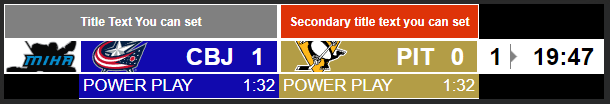
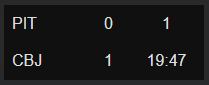

## tl;dr

In the coming months, I will be adding a monthly subscription option to Sport Scores Bot to help support me and the work I do. No existing features will be moved behind the paywall, but the ticker will be getting a slight facelift. The initial features available to users who subscribe will be alternative designs to the ticker & scoreboard with more to come. The subscription will start at $5/month.

## Why a monthly subscription?

This is probably the biggest initial question people will have and the short answer is that running this platform and my time developing it is not free. 

The slightly longer answer is that I would like to be able to cover the costs of hosting this & eventually cover the cost of my time developing this and help me make more cool things. Currently, everything in the bot and platform is free and all of the costs come out of my pocket. I was lucky enough to be sponsored by Bisect Hosting who gave me a server and covered the cost of it for a while, but not long ago I ended up switching to a different host due to some issues & needing more resources. This new server is not free, but luckily only costs me ~$15 a month. I've also been fortunate enough to have received single-time donations from some amazing users and I would like to think that those have cancelled out the money I've spent on this monthly server cost, but I'd have to do the math to know for sure. That being said, it has not even come close to cancelling out the hundreds of hours I spent building and developing this platform and this is what I hope this support from the subscription can help out with.

## My Philosophy With Monthly Subscriptions

There is rightly some cause for concern whenever you hear a product is gaining a monthly subscription. Some people outright hate the concept of monthly subscriptions and others feel it's just a way for companies to be more greedy and squeeze more money out of their customers. I don't fully disagree with those, but my goal with having this subscription is to make you feel like you want to support me and this project and not that you have to subscribe in order for this product to be usable. Walking that fine line will for sure be hard, but there are things that I personally will hold myself to because I think it's the right way to handle a subscription.

First off no feature that is currently free or is free when it is added will be moved to be behind the paywall. I think this goes with the idea of essentially being forced to pay for a product when features are moved behind a paywall. There have numerous instances where this happens and it's rare that I feel it's ever justified and doesn't just ruin the experience or usefulness of a product. This being said I can think of 2 reasons why I would have to break this promise. Either a feature relies on a 3rd party that suddenly starts charging for this feature (Basically what I'm pledging to try not do), or a feature becomes so resource/ processing intensive that drives my operating costs too high. In either of these situations there are many steps I'd take to mitigate these issues and moving them behind a paywall will be far from my first solution, but I do want to be transparent why this could have future implications. I just don't want you to feel concerned that me adding a subscription will mean you'll lose access to features. You should feel safe in knowing the future of this product as it impacts your stream.

Secondly, What you pay today for x features is what you can pay forever. This one is more of a personal preference, but I don't want users to be worried about price hikes to their monthly subscription as I feel like it brings up the earlier point of losing access to features because of changes I make. This isn't to say that the price will always be $5/month, but if I were to raise the price, no one who is actively paying their monthly amounts will have their price changed. If one day I decide to increase the price to $6.99/month, only new users will be put into this price range. That being said, only having paid for 2 months, 6 months ago won't qualify you for the old price. This is targeted solely to "full-time" supporters and I feel it rewards people for supporting for the long run. In the future I may also add new tiers if a feature really necessitates it or maybe it'll have its own addon price, I don't know, but the bottom line is the price you pay now, and as long as you keep paying it, will be the price you pay forever and you won't lose any features like mentioned above.

Realistically these two points about cover my thinking towards how this subscription will work and adapt over time. Like I said, I really want you to feel like you're supporting me and gaining access to cool additional features without feeling like you have to pay in order to get a good experience out of this platform. I will keep adding new free features as well as more features that will go behind this paywall over time, but I don't want this to feel like a paid-for product. I'm all open to comments, questions, concerns or whatever on this, always feel free to send me a message.

## When?

Not 100% sure yet as I will have to build out all the infrastructure to support payments and tracking user subscription status for features, but in the first half of the year is probably a good initial estimate. Luckily though it won't matter when it goes live as nothing will change to the existing features! You'll simply get access to more if you choose to support with this subscription!

With all of that out of the way though, let's talk about what new features will be coming to users who support me through this subscription.

## New Ticker
The ticker currently in SSB is pretty awkward. It's half a scoreboard and half a ticker and to be honest... half-baked. This is going to change though as I have been working on another tangentially related project and it has allowed me to develop more true functioning tickers and scoreboards. I have since decided to try and dual purpose these in both my new project and use it to replace the existing ticker in SSB. These new scoreboards and tickers are what I am planning to be the first features to be behind this paywall. What does that mean for the existing tickers? Don't worry, the existing look, while being tweaked and corrected functionally, will remain free to use for good. As I said earlier, I do not want, nor do I have intentions of taking away functionality to hide it behind a paywall. The new styles that I have created for the ticker will however be behind the subscription. I guess you can think of them as skins.

To start there will be 2 new looks. First being a minimalistic design:

The second is a vintage ESPN style:

Over time I'd love to add more, but these 2 new looks, plus the original, will be added to start. If you have any suggestions on other designs or even how to improve these designs let me know!

## Scoreboard
Yes, I know the site currently says scoreboard, but realistically it's a ticker. Due to this other project though I'd like to bring over the scoreboards I'm making there and make them available to use on SSB by users who want a singular & more informative scoreboard on their stream that reflects the live state of a game. This one isn't fully fleshed out yet with how it'll interface with SSB, but I currently have 4 designs:

A Minimal look, inspired by the scoreboard used in televised MLS games:

A more feature complete scoreboard design:

A Scoreboard geared towards baseball:

Another more minimal box scores scoreboard:

Like the Ticker though, I do plan to have one (or more) of these scoreboards available to everyone for free with possibly only the more feature-complete or complex designs behind the subscription paywall. This is still to be determined, but I do want users to have some designs they can use freely.

## Other Possible Subscription Features

For now, the Ticker & Scoreboard are the only 2 things that will be on the subscription, but I want to add more features over time. I do have some ideas for possible features to add and I would love to hear what you guys think!

### Custom Bot Name

Currently, every channel gets message updates through the Sport_Scores_Bot bot account, but it would be cool if you could use your own custom bot account to send these messages. This will likely require a lot of work & also probably increase the resource usage which is why it would 100% be a paid feature, but cool to have nonetheless for those interested.

### Priority/ Special Visuals on Stream Preview on the Site

This is purely cosmetic & I don't think many people even use the SSB site to browse streams, but giving supporters a priority in the otherwise randomly ordered list of live streamers using the bot as well as some added supporter visuals could be possible.

### Pick'em Group Creation

Pick'em games are something that I explored back when I first made the bot but ultimately scraped for the future. Well, the future is here and I have begun to make and test out some more pick'em games that I may bring over and integrate into Sport Scores Bot. If I do, I may gate the creation of groups behind the subscription, but allow anyone to join a group if they are allowed. This would just lower the overhead and prevent infinite groups from being created, but also everyone to still participate.

## The End

That's it! Thanks for reading! I wanted to write this down more just to get my thoughts and plans all organized, but if you like this and want to see more "dev blog" posts about SSB then let me know what you'd be interested in reading about!

## Additional FAQ

As questions are asked that aren't answered above I will add them here!